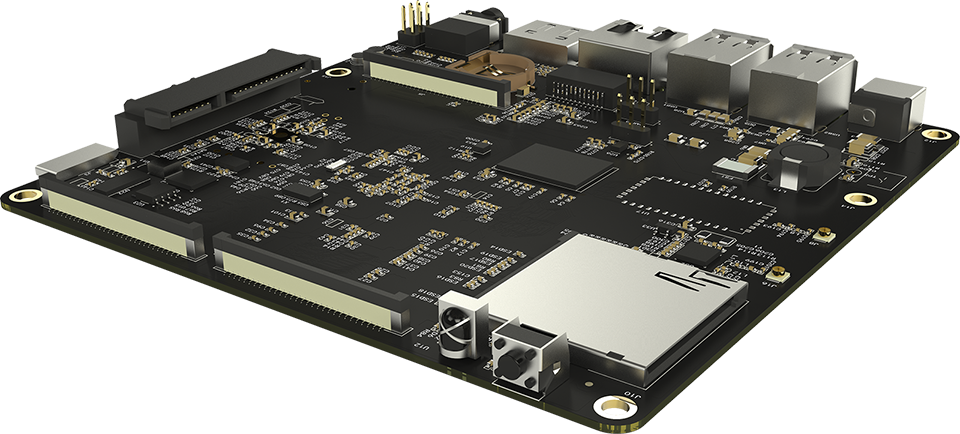
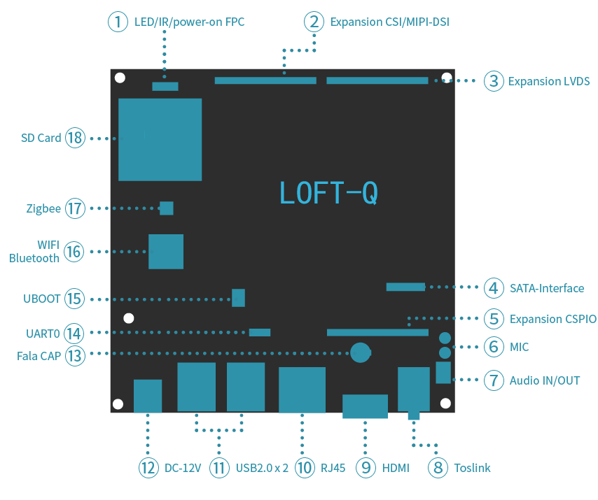
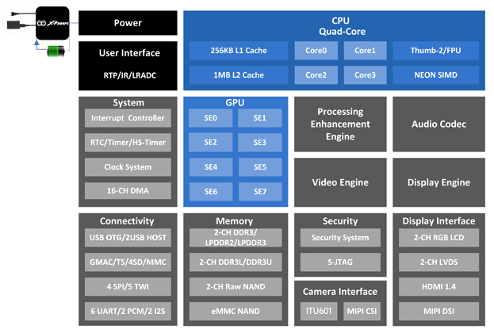
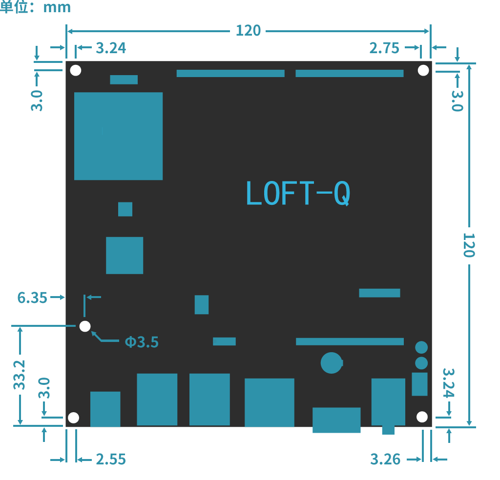

================
LOFT-Q 产品说明
================

|
|
|
|
|
|
|
|

.. raw:: pdf

   PageBreak

产品概述
---------
LOFT-Q是基于全志A31芯片的迷你单板开源计算机，具有强大的可拓展性，能够满足用户众多的拓展需求,将LOFT-Q作为一个小而强的计算机使用，将是一个充满想象的选择!

产品特性
---------

#. 低功耗四核处理器
#. 开源软件支持, U-Boot, Linux Kernel
#. 板载 2.5 英寸 SATA III 硬件接口，可作为低功耗小型 NAS 
#. 2GB 64 位 DDR3 内存
#. 独家板载低功耗 ZigBee 芯片
#. 提供 180-PIN 扩展接口
#. ``1080P@60Hz`` HDMI 输出
#. 支持 4096x2304 视频解码
#. 板载 8GB eMMC 大容量存储
#. 板载加速度传感器
#. 蓝光播放 (需要全志非开源驱动支持)
#. 兼容 NANO-ITX PCB 外形和螺丝孔尺寸

.. raw:: pdf

   PageBreak

产品配置
-------------

硬件接口
''''''''''

=======================      ================  ==============================
  名称                         位置标号           描述
=======================      ================  ==============================
LED/IR/POWER-ON FPC           1                LED指示灯、红外、开关机按键接口
EXPANSION CSI/MIPI-DSI        2                摄像头和MIPI显示器扩展口
EXPANSION LVDS                3                LVDS接口的显示屏扩展口
SATA Interface                4                硬盘扩展接口
EXPANSION GPIO                5                扩展的GPIO和通用总线接口
MIC                           6                带去噪功能、双麦输入
AUDIO IN/OUT                  7                外放输出、模拟音频输入
Toslink                       8                SPDIF输出、耳机模拟音频输出
HDMI OUT                      9                HDMI A型母座输出接口，支持1080P
RJ45                          10               千兆以太网接口
USB2.0 X 2                    11               双层两组USB2.0接口、共四个USB口
DC-12V JACK                   12               直流电源输入接口12V/4A
FALA CAP                      13               SMT法拉电容焊接口
UBOOT                         14               用于UBOOT、启动方式选择的拨码开关
UART0                         15               调试串口0
WiFi 天线接口                  16              I-PEX母座
ZigBee 天线接口                17              I-PEX母座
SD CARD                        18              SD V3.0接口，最大支持128G
=======================      ================  ==============================

A31 芯片架构
''''''''''''''

* ARM Cortex‐A7  四核 CPU 架构 
* IMG PowerVR SGX544MP2 GPU 图像处理架构 
* 强劲的 4K 视频解码 
* 双路 DDR,双路 NAND Flash 
* 集成先进的 HawkView ISP 图像信号处理单元 
* 集成 MIPI DSI/MIPI CSI 接口 
* 集成高性能 Audio Codec 

.. raw:: pdf

   PageBreak

硬件详细参数
-------------

基本配置
'''''''''''

* CPU 运行主频: Cortex-A7 四核架构,1GHz 
* CPU 型号:全志 A31                    
* GPU:PowerVR SGX544MP2 多核 GPU(显卡)  
* 2GB 64bit 双通道 DDR3 内存           
* 8GB 高速闪存(eMMC)   

多媒体
'''''''''''

* H.264 HP: 4096x2304 视频解码
* 双通路 LVDS ``1920×1080@60fps``
* 支持多种视频格式: Mpeg1, Mpeg2, Mpeg4 SP/ASP GMC, XVID, H.263, Sorenson Spark,H.264 BP/MP/HP,WMV7/8,WMV9/VC1 BP/MP/AP
* ``4096x2160@30fps`` 3D 编码  

显示输出
''''''''''''

* 支持 HDMI 1.4, 最高支持 ``1080P@50/60fpts``。 
* 双通路 RGB/CPU/LVDS LCD, 支持 ``1080p@60fps`` 
* 4 lanes MIPI DSI,支持 ``1920x1200/1080p@60fps``

标准接口
'''''''''''

* 音频输出: 3.5mm 音频座 1 个、SPDIF OUT、Speak OUT 
* 音频输入: line in 
* HDMI: 一个标准 HDMI 1.4 
* USB 2.0 Host: USB A 型口 4 个 
* SD 卡座:1 个(TF 卡) 
* 以太网: RJ45 接口,支持 1000M/100/10M 自适应 
* 电源接口座: 1 个, 规格:DC 座 5.6X2.0mm ,适用于 5.5X2.1mm DC 头 

插针接口
''''''''''''

* EXPANSION LVDS: 60pin 0.5mm 间距立式推拉 FPC 座,含 LCDx1,LVDSx2,PWM,RTP,CTP,GPIO,GND 3.3V 等信号 
* EXPANSION CSI/MIPI-DSI: 60pin 0.5mm 间距立式推拉 FPC 座,含 CSI,I2C,MIPI-DSI,SPDIF-IN/OUT,ADC,I2S-IN,1.8V/5V/3.3V/GND 
* EXPANSION GPIO:60pin 0.5mm 间距立式推拉 FPC 座,含 UART,JTAG,SPI,MIPI-CSI,I2C,GPIO,5V/3.3V/GND
* UART 串口: 1 路,2.54mm 间距针座(UART0) 
* SATA 5V/12V:1 个,专门给 SATA 硬盘供电,支持 5V 和 12V 供电硬盘 (可软件控制) 
* LED/IR/POWER-ON FPC 接口:1 个,用于扩展接红外接收,呼吸灯指示,按键开关机等功能

尺寸工艺
''''''''''''

* PCB 尺寸:120x120mm 
* 沉金工艺,高 TG 值板材 

其他资源
''''''''''''

* WIFI 蓝牙模组 AP6234,WIFI 最高支持 150Mbps,支持 2.4G 和 5G,支持蓝牙 4.0
* ZigBee 收发模组
* 双麦输入,带去噪功能

功能扩展
'''''''''''

* 3G 上网(外接 3G 上网卡) 
* WiFi(外接模块) 
* 蓝牙(外接模块) 
* 多 U 盘挂载
* SATA 硬盘:最大可接 2T(2.5 寸) 
* 外置鼠标控制 
* USB 摄像头

板卡尺寸和螺丝分布图
'''''''''''''''''''''

FPC 连接座扩展 PIN 脚说明
''''''''''''''''''''''''''

EXPANSION CSI/MIPI‐DSI(J4)
##########################

=========    =============    =============    =============
引脚号        功能             引脚号            功能
=========    =============    =============    =============
1             CSI-D0           2                CSI-D1
3             CSI-D2           4                CSI-D3	
5             CSI-D4           6                CSI-D5
7             CSI-D6           8                CSI-D7
9             CSI-D8           10               CSI-D9
11            CSI-D10          12               CSI-D11
13            GND              14               CSI-HSYNC
15            CSI-VSYNC        16               TWI0-SCK
17            TWI0-SDA         18               GND
19            CSI-MCLK         20               CSI-PCLK
21            GND              22               VDD1V8-CSI
23            VDD1V8-CSI       24               GND
25            VCC-5V           26               VCC-5V
27            GND              28               VCC-3V3
29            VCC-3V3          30               GND
31            MCSI-MCLK        32               NC
33            NC               34               GND
35            DSI-D0N          36               DSI-D0P
37            GND              38               DSI-D1N
39            DSI-D1P          40               GND
41            DSI-D2N          42               DSI-D2P
43            GND              44               DSI-D3N
45            DSI-D3P          46               GND
47            DSI-CKN          48               DSI-CKP
49            GND              50               SPDIF-IN
51            SPDIF-OUT        52               GND
53            I2S1-DIN         54               I2S1-BCLK
55            I2S1-LRCK        56               I2S1-MCLK
57            EARGND2          58               LRADC0
59            EARGND2          60               LRADC1
=========    =============    =============    =============

EXPANSION GPIO(J5) 
####################

=========    =============    =============    =============
引脚号        功能             引脚号            功能
=========    =============    =============    =============
1             VCC-5V           2                VCC-5V
3             GND              4                VCC-LCD	
5             VCC-LCD          6                GND
7             UART4-TX         8                UART4-RX
9             GND              10               VCC-JTAG
11            VCC-JTAG         12               AP-RESET#
13            TMS0             14               TCK0
15            TDO0             16               TDI0
17            JTAG-SEL0        18               GND
19            SPI0-MOSI        20               SPI0-MISO
21            SPI0-CLK         22               SPI0-CS0
23            GND              24               CSI2-D0N
25            CSI2-D0P         26               GND
27            CSI2-D1N         28               CSI2-D1P
29            GND              30               CSI2-D2N
31            CSI2-D2P         32               GND
33            CSI2-D3N         34               CSI2-D3P
35            GND              36               DSI-D0P
37            CSI2-CKP         38               GND
39            TWI3-SCK         40               TWI3-SDA
41            GND              42               MCS-MCLK1
43            GND              44               CAM-R-STBY-EN
45            CAM-R-RESET#     46               GND
47            PH0              48               PH1
49            PH2              50               PH3
51            PH4              52               PH5
53            PH6              54               PH7
55            PH8              56               PH29
57            PH30             58               GND
59            USB-DP0          60               USB-DM0
=========    =============    =============    =============

EXPANSION LVDS(J6)
####################

=========    =============    =============    =============    =============   =============
引脚号        第一功能         第二功能          引脚号           第一功能         第二功能
=========    =============    =============    =============    =============   =============
1             LVDS0-D0P        LCD0-D0          2                LVDS0-D0N       LCD0-D1
3             GND                               4                LVDS0-D1P       LCD0-D2
5             LVDS0-D1N        LCD0-D3          6                GND
7             LVDS0-D2P        LCD0-D4          8                LVDS0-D2N       LCD0-D5
9             GND                               10               LVDS0-CLKP      LCD0-D6
11            LVDS0-CLKN       LCD0-D7          12               GND
13            LVDS0-D3P        LCD0-D8          14               LVDS0-D3N       LCD0-D9
15            GND                               16               LVDS1-D0P       LCD0-D10
17            LVDS1-D0N        LCD0-D11         18               GND
19            LVDS1-D1P        LCD0-D12         20               LVDS1-D1N       LCD0-D13
21            GND                               22               LVDS1-D2P       LCD0-D14
23            LVDS1-D2N        LCD0-D15         24               GND
25            LVDS1-CLKP       LCD0-D16         26               LVDS1-CLKN      LCD0-D17
27            GND                               28               LVDS1-D3P       LCD0-D18
29            LVDS1-D3N        LCD0-D19         30               GND
31            LCD0-D20                          32               LCD0-D21
33            LCD0-D22                          34               LCD0-D23
35            LCD0-CLK                          36               LCD0-HSYNC
37            LCD0-DE                           38               LCD0-VSYNC
39            LCD-PWM                           40               LCD-BL-EN
41            GND                               42               CTP-WAKE
43            CTP-INT                           44               TWI1-SCK
45            TWI1-SDA                          46               GND
47            RTP-X1                            48               RTP-X2
49            RTP-Y1                            50               RTP-Y2
51            GND                               52               VCC2V8-LCD
53            VCC2V8-LCD                        54               VCC2V8-LCD
55            GND                               56               VCC1V8-LCD
57            VCC1V8-LCD                        58               GND
59            VCC-5V                            60               VCC-5V
=========    =============    =============    =============    =============   =============

LED/IR/POWER‐ON FPC(J21)
############################

=========    =============    =============    =============
引脚号        功能             引脚号            功能
=========    =============    =============    =============
1             VCC-NRF          2                GND
3             IR-RX            4                PWR-ON
5             LED1-R           6                LED2-G
7             LED3-B           7                GND
=========    =============    =============    =============

2.54mm 排针座扩展口 
'''''''''''''''''''''

AUDIO IN/OUT(J17) 
###################

=========    =============    =============    =============
引脚号        功能             引脚号            功能
=========    =============    =============    =============
1            SPKL             2                 SPKR
3            AGND             4                 AGND
5            LINEINL          6                 LINEINR
=========    =============    =============    =============

.. raw:: pdf

   PageBreak

软件资源
----------

LOFT-Q 基于全志设计的 A31 芯片，除了全志以及前述的 Linux-sunxi 社区支持之外，Mixtile 项目在 Github 也提供了相关的开放资源。

loftq-docs
'''''''''''''''

LOFT-Q 项目软件相关文档，主要文档包括：LOFT-Q 相关说明（环境搭建，buildroot 构建说明， ubuntu touch, opensuse 等构建说明，android 构建打包说明等）。

链接地址： https://github.com/mixtile/loftq-docs

loftq-build
'''''''''''''''

主要用于完成 LOFT-Q 项目中 uboot, linux, android, buildroot, 以及 ubuntu touch 等的构建，打包工作，包含有原厂的一些构建工具，linaro-gcc 工具链， LOFT-Q 项目的 linux/android 的 sys_config, sys_partition, 开机画面等配置文件。

链接地址： https://github.com/mixtile/loftq-build

loftq-uboot
'''''''''''''''

用于 LOFT-Q 项目中引导 linux/android 以及其他项目的 uboot 代码，基于原厂提供的 A31 的 uboot 源代码。

链接地址： https://github.com/mixtile/loftq-uboot

loftq-linux
'''''''''''''''

用于 LOFT-Q 项目的 linux kernel, 基于原厂提供 A31 内核源代码，并添加了一些适用于 LOFT-Q 的硬件配置。

链接地址： https://github.com/mixtile/loftq-linux

loftq-factorytest-qt
'''''''''''''''''''''''''

用于 LOFT-Q 的产测程序，基于 QT 和 Buildroot，还未完成。

链接地址： https://github.com/mixtile/loftq-factorytest-qt

loftq-factorytest-android
'''''''''''''''''''''''''''

用于 LOFT-Q 的产测程序，用于 Android 平台。

链接地址: https://github.com/mixtile/loftq-factorytest-android

mixtile-ubuntu-touch
''''''''''''''''''''''

LOFT-Q 定制的 Ubuntu Touch 固件包。

Repository: https://github.com/mixtile/mixtile-ubuntu-touch

Buildroot
''''''''''''''''''

用于 LOFT-Q 项目的 buildroot，基于 buildroot 官网最新代码，并添加了 LOFT-Q 相关配置文件。将会定期对 buildroot 进行更新以使用最新的软件包。

链接地址： https://github.com/mixtile/buildroot

Android
'''''''''''''''

用于 LOFT-Q 项目的 android 源代码，基于原厂的 A31 的盒子版的 android 4.4.2 版本，并添加适用于 LOFT-Q 原型版的 wifi, 蓝牙等外设的驱动固件。

链接地址： http://www.focalcrest.com/cn/pc.html

